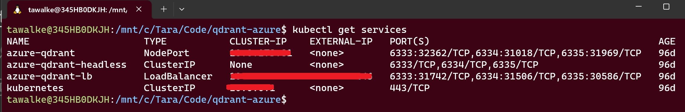

# Qdrant Vector Database on Azure Cloud

This project provides resources to deploy the Qdrant vector database on Azure using Azure Kubernetes Service (AKS) with Helm (custom chart w/qdrant helm dependency).

## Prerequisites

To get started, users will need access to an Azure subscription.
Users will also need to have the following installed on their local machine:

- **Helm:**
  Helm can be installed via package manager or with the Helm script for bash shell provided in folder `scripts` in this directory. 
  ***To install Helm using script run the following command:***
  ```bash
  chmod 700 get_helm.sh 
  ./get_helm.sh
  ```

  Alternatively, helm can be installed via various package managers for Windows and/or MacOs by following the instructions note in the [Helm documentation](https://helm.sh/docs/intro/install/).

  ***Documentation Example: Install Helm on Windows with Powershell***
  ```powershell
  choco install kubernetes-helm
  ```

- **Kubectl:**
  Tools for Kubernetes will need to installed. You install kubectl using the Azure CLI by executing the `az aks install-cli` command.  Alternatively, following the instruction in the [Kubernetes documentation](https://kubernetes.io/docs/tasks/tools/#kubectl) to install kubectl.

As a convenience, a kubectl install script is provided in the `scripts` folder in this directory.

If using the Visual Studio Code dev container, both Helm and Kubectl are installed as features of the dev container.

### Getting Started

You can get started by using the **Deploy the Azure** button shown below.

#### Deployment

To deploy the Qdrant service on Azure Kubernetes Service with an Azure volume, you must first ensure that the AKS cluster is running. You can create a cluster using the **Deploy to Azure** button below, or manually using the Azure Portal or Azure CLI.

[](https://portal.azure.com/#create/Microsoft.Template/uri/https%3A%2F%2Fraw.githubusercontent.com%2FAzure-Samples%2Fqdrant-azure%2Fmain%2FAzure-Kubernetes-Svc%2Faks-arm-deploy.json)

> This solution contains _both_ an Azure Bicep and an ARM template.  The **Deploy to Azure** button uses the ARM template.  To use the Bicep template, please follow the instructions below for using the Azure CLI or Azure PowerShell.

To create an AKS cluster, you will need to provide an SSH public key.  A key can be generated using the `ssh-keygen` command, as shown in the example below.

```bash
ssh-keygen -t rsa -b 4096
```

When prompted, provide the following values:

- **Linux admin username**: Enter a username to connect using SSH, such as _azurek8sadmin_.
- **SSH RSA public key**: copy and paste the _public_ part of your SSH key pair (by default, the contents of _~/.ssh/id_rsa.pub_).

##### Azure CLI

To create an AKS cluster using the Azure CLI, open the command line and run the following command:

```bash
  az deployment group create \
  --name ExampleDeployment \
  --resource-group ExampleGroup \
  --template-file main.bicep \
```

##### Azure PowerShell

To deploy using the Azure Powershell, open the Powershell command line and run the following command:

```powershell
   New-AzResourceGroupDeployment `
      -Name remoteTemplateDeployment `
      -ResourceGroupName ExampleGroup `
      -TemplateFile main.bicep
```

#### Installation

After the AKS cluster has been created, you can deploy Qdrant on Azure Kubernetes Service with Helm. Go to the **qdrant-on-azure** folder which contains the Helm chart for Qdrant and run the following commands:

1. Configure kubectl to connect to your Kubernetes cluster using the `az aks get-credentials` command:

    ```bash
    az aks get-credentials --resource-group <your-resource-group-name> --name <your-aks-cluster-name>
    ```
    Once you have configured kubectl with credential, you can verify the nodes are running successfully by running the following command:
    ```bash
    kubectl get nodes
    ```
    

2. From the current directory (Azure-Kubernetes-Svc/qdrant-on-azure), install Qdrant on Azure Kubernetes Service with Helm by running the following command:

    ```bash
    helm install <your installation name> ./qdrant-on-azure --create-namespace
    ```
    **OR for custom namespace**
    ```bash
    helm install <your installation name> ./qdrant-on-azure --namespace <your desired namespace> --create-namespace
    ```

3. If you wish to verify your installation, Create a collection in Qdrant, as shown in the [Qdrant quick start documentation](https://qdrant.tech/documentation/quick_start/#create-collection).

***Note: Your load balancer public IP address can be found by running the command: ```kubectl get services``` and copying the IP address from the **EXTERNAL-IP** column for **TYPE** LoadBalancer.***



    ```bash
    curl -X PUT 'http://[YOUR-LOAD-BALANCER-PUBLIC-IP-ADDRESS]:6333/collections/test_collection' \
    -H 'Content-Type: application/json' \
    --data-raw '{
        "vectors": {
            "size": 4,
            "distance": "Dot"
        }
    }'
    ```

    Verify the collection was created:

    ```bash
    curl 'http://[YOUR-LOAD-BALANCER-PUBLIC-IP-ADDRESS]:6333/collections/test_collection'
    ```

## Resources to Learn More

- [Azure Kubernetes Service](https://learn.microsoft.com/azure/aks/)
- [Azure Kubernetes Service with Helm](https://learn.microsoft.com/azure/aks/quickstart-helm)
- [Qdrant Installation with Kubernetes](https://qdrant.tech/documentation/install/#with-kubernetes)
- [Qdrant integration with OpenAI](https://qdrant.tech/documentation/integrations/#openai)
