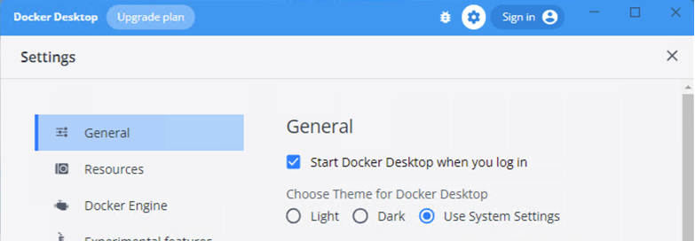

# Qdrant Vector Database on Azure Cloud
Install the Qdrant vector database on Azure using:
- **Qdrant container in Docker Desktop**

# Getting Started

## Installation

Install the following software on your machine:
- Install the [Docker engine](https://docs.docker.com/engine/install). 
Note: Docker is used to run [Qdrant](https://qdrant.tech) vector search engine.
To persist data, you will need to configure storage (volume) or store your data.
You can read more about this in the [Docker Storage documentation](https://docs.docker.com/storage/).


## Start Docker engine

Ensure that the Docker engine service is running on your computer. Docker can be configured to run automatically when your computer starts. This is the recommended setup.



## Configure Docker

To configure docker services for Qdrant Docker, please follow the instructions below.

**Docker (Local)**

To run the Qdrant vector database running in Docker locally, please follow the instructions from Qdrant's website: 
[Install Qdrant with Docker](https://qdrant.tech/documentation/install/#with-docker)

You can use the following Docker command to run Qdrant using default values stored in the file [.config/config.yaml](./.config/config.yaml) located in the Local Docker Deployment folder. 

```bash
docker run -p 6333:6333 \
    -v $(pwd)/path/to/data:/qdrant/storage \
    -v $(pwd)/path/to/custom_config.yaml:/qdrant/config/production.yaml \
    qdrant/qdrant
```
You can overwrite values by creating and adding new records to a file ./config/production.yaml. An example of the [production.yaml](./.config/production.yaml) file located in the Local-Docker directory. Please review the [Qdrant documentation](https://qdrant.tech/documentation/install/#configuration) to learn more information on configuration options.


