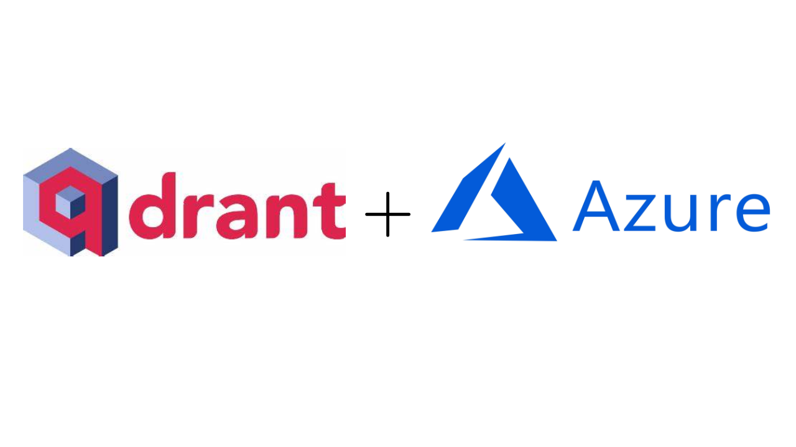

# Qdrant Vector Database on Azure Cloud



This project combines the power of the Qdrant Vector Database with the Microsoft Azure Cloud
allowing you to bring Vector Search and Embeddings storage to your AI products. 

# Getting started
You have several options for how to get Qdrant running on Azure:
- [Azure Container Instance](Azure-Container-Instances/README.md)
- [Azure Kubernetes Service](Azure-Kubernetes-svc/README.md)
- [Qdrant Container in Docker](Local-Docker-Deployment/README.md)

## Prerequisites

To get started, users will need access to an Azure subscription.

To deploy using the Deploy to Azure button which leverages an ARM template, you need write access on the resources you're deploying and access to all operations on the Microsoft.Resources/deployments resource type.

## Installation

**Azure Container Instances**

To deploy Qdrant to an Azure Container Instance with Azure Volume, go to the `Azure-Container-Instances` folder and follow instructions in the `README.md` to deploy to the Azure Container Instances (ACI) service.

Additionally, you can deploy using the **Deploy to Azure button** below. 

If using the **Deploy to Azure button**, this setup a storage account in Azure for you. Please ensure you have permissions for Azure Container Services and Azure Storage Accounts.

[](https://portal.azure.com/#create/Microsoft.Template/uri/https%3A%2F%2Fraw.githubusercontent.com%2FAzure-Samples%2Fqdrant-azure%2Fmain%2FAzure-Container-Instances%2FARM-templates%2Fqdrant-deploy-aci-linkedstorage-params.json)

**Azure Kubernetes Service**

To deploy Qdrant to a cluster running in Azure Kubernetes Services, go to the `Azure-Kubernetes-Svc` folder and follow instructions in the `README.md` to deploy to a Kubernetes cluster with Load Balancer on Azure Kubernetes Services (AKS). 

You can quickly create an **Azure Kubernetes Service** cluster by clicking the Deploy to Azure button below. After creating your AKS cluster, go to the `Azure-Kubernetes-Svc` folder to deploy **Qdrant** into the AKS cluster using **Helm**.

[](https://portal.azure.com/#create/Microsoft.Template/uri/https%3A%2F%2Fraw.githubusercontent.com%2FAzure-Samples%2Fqdrant-azure%2Fmain%2FAzure-Kubernetes-Svc%2Faks-arm-deploy.json)


**Docker (Local)**

To run the **Qdrant** vector database running in **Docker** locally, please follow the instructions from Qdrant's website: 
[Install Qdrant with Docker](https://qdrant.tech/documentation/install/#with-docker)

To run Qdrant with Docker locally, you can use the following command using  default values stored in the file `.config/config.yaml` located in the `Local-Docker-Deployment` folder. 

```bash
docker run -p 6333:6333 \
    -v $(pwd)/path/to/data:/qdrant/storage \
    -v $(pwd)/path/to/custom_config.yaml:/qdrant/config/production.yaml \
    qdrant/qdrant
```
You can overwrite values by creating and adding new records to a file `./config/production.yaml`. An example of the production.yaml file located in the `Local-Docker-Deployment` directory. Please review the [Qdrant documentation](https://qdrant.tech/documentation/install/#configuration) to learn more information on configuration options for **Qdrant**.

## Resources for Learning More
- Qdrant Vector Search (Vector Database): https://qdrant.tech/
- Qdrant Integration with OpenAI: https://qdrant.tech/documentation/integrations/#openai
- Azure Container Instances (ACI): https://learn.microsoft.com/en-us/azure/container-instances/
- Azure Kubernetes Service (AKS): https://learn.microsoft.com/en-us/azure/aks/
- Docker Desktop: https://docs.docker.com/desktop/ 
