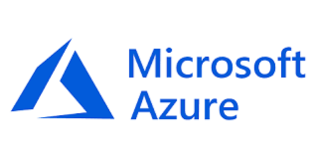

# Qdrant Vector Database on Azure Cloud


] 

Run the Qdrant vector engine (vector database) on Azure using:
- **Azure Container Instance**
- **Azure Kubernetes Service**
- **Qdrant container in Docker**

## Project Information
---
Description: This project provides resources to deploy the Qdrant Vector database to Azure using Azure Container Instances and/or Azure Kubernetes Service via ARM template, bicep, or Helm Chart.

# Qdrant Vector DB with Volume on Azure 

## Features
This project framework provides the following features:

* Ability to deploy the Qdrant vector database using via Azure Container Instance for use in storing AI generated embeddings 
* Ability to deploy persistent volume with ACI to store/persist Qdrant data
* Ability to run a scalable Qdrant cluster on Kubernetes with AKS. 
* Ability to run Qdrant on local desktop with Docker. 

## Getting Started

### Prerequisites

To get started, users will need access to an Azure subscription.

### Installation

**Azure Container Instances**

To deploy Qdrant to an Azure Container Instance with Azure Volume, go to the `Azure-Container-Instances` folder and follow instructions in the `README.md` to deploy to the Azure Container Instances (ACI) service.

Additionally, you can deploy using the **Deploy to Azure button** below. 

If using the **Deploy to Azure button**, this setup a storage account in Azure for you. Please ensure you have permissions for Azure Container Services and Azure Storage Accounts.

[](https://portal.azure.com/#create/Microsoft.Template/uri/https%3A%2F%2Fraw.githubusercontent.com%2FAzure-Samples%2Fqdrant-azure%2Fdev-azure-multideploy%2FAzure-Container-Instances%2FARM-templates%2Fqdrant-deploy-aci-linkedstorage.json)

**Azure Kubernetes Service**

To deploy Qdrant to a cluster running in Azure Kubernetes Services, go to the `Azure-Kubernetes-Svc` folder and follow instructions in the `README.md` to deploy to a Kubernetes cluster with Load Balancer on Azure Kubernetes Services (AKS).

**Docker (Local)**

To run the Qdrant vector database running in Docker locally, please follow the instructions from Qdrant's website: 
[Install Qdrant with Docker](https://qdrant.tech/documentation/install/#with-docker)

To run Qdrant with Docker locally, you can use the following command using  default values stored in the file .config/config.yaml located in the Local Docker folder. 

```bash
docker run -p 6333:6333 \
    -v $(pwd)/path/to/data:/qdrant/storage \
    -v $(pwd)/path/to/custom_config.yaml:/qdrant/config/production.yaml \
    qdrant/qdrant
```
You can overwrite values by creating and adding new records to a file ./config/production.yaml. An example of the production.yaml file located in the Local-Docker directory. Please review the [Qdrant documentation](https://qdrant.tech/documentation/install/#configuration) to learn more information on configuration options.

## Resources

- Qdrant Vector Search (Vector Database): https://qdrant.tech/
- Qdrant Integration with OpenAI: https://qdrant.tech/documentation/integrations/#openai
- Azure Container Instances (ACI): https://learn.microsoft.com/en-us/azure/container-instances/
- Azure Kubernetes Service (AKS): https://learn.microsoft.com/en-us/azure/aks/
- Docker Desktop: https://docs.docker.com/desktop/ 
